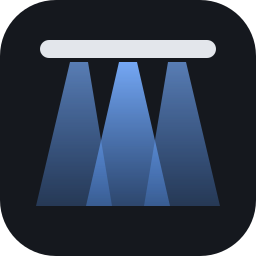
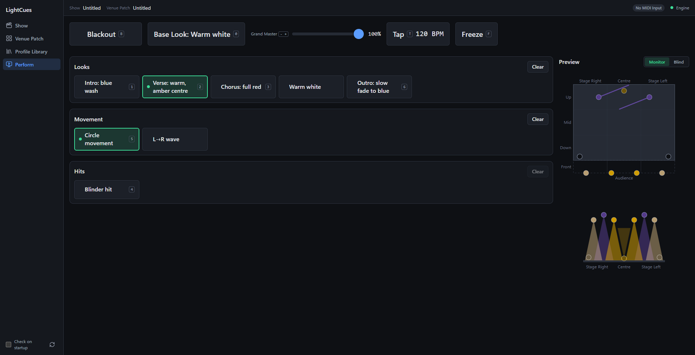
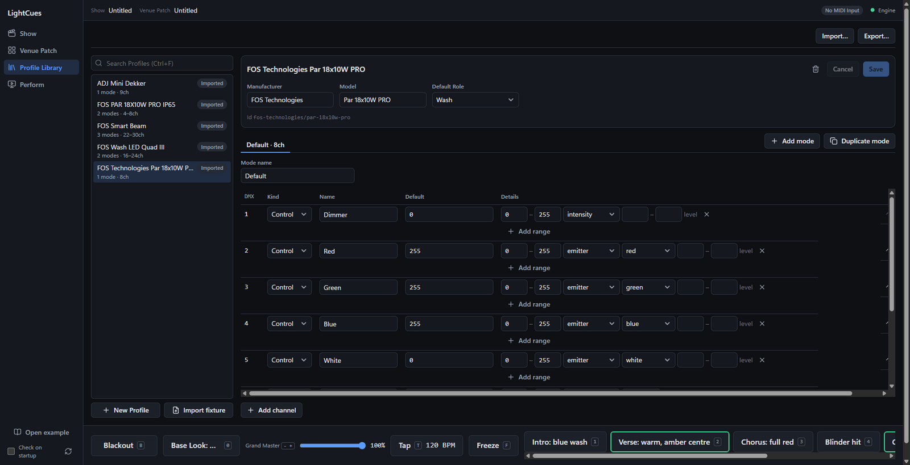
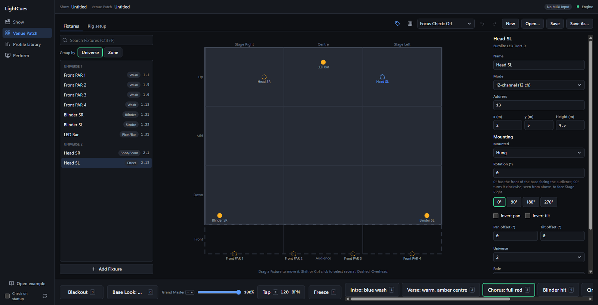
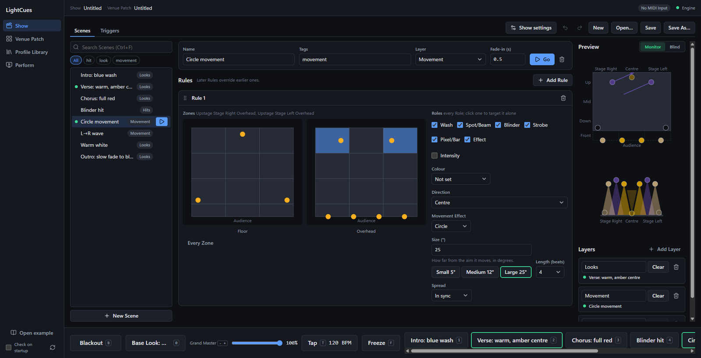
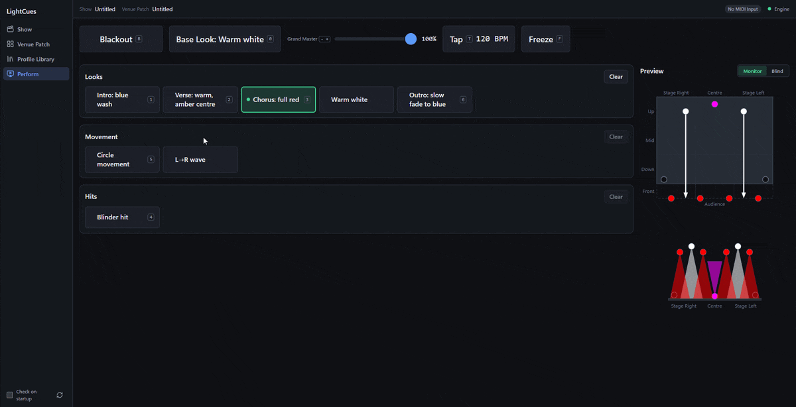

#  LightCues

Lights for your gig that follow your DAW, at any venue.

*Perform, the view for the gig. Verse plays on the Looks Layer and Circle movement on the Movement Layer.*

Building from source: [docs/development.md](docs/development.md).

## What it does

- Your DAW or MIDI controller fires the lights. Each song's MIDI notes start Scenes, with no one at the desk.
- You program the Show once. Scenes aim at parts of the stage (Zones) and kinds of light (Roles: Wash, Spot/Beam, Blinder, …), not at particular Fixtures.
- A new venue means re-patching, not re-programming. Make a Venue Patch for the house rig, place the Fixtures on the stage plan, and the Show adapts.
- If MIDI drops, the current look holds. The Fallback Panel is on screen in every view, and Perform has the same controls: Blackout, Base Look, Grand Master, Tap Tempo, Freeze and your chosen Scene buttons, each with a key.

## Requirements

- Windows 10 or 11, 64-bit.
- A DMX interface: Enttec DMX USB Pro or DMXking ultraDMX.
- Optional, for MIDI: a DAW or MIDI controller. From a DAW on another laptop, use [rtpMIDI](https://www.tobias-erichsen.de/software/rtpmidi.html) (network MIDI). From a DAW on the same PC, use [loopMIDI](https://www.tobias-erichsen.de/software/loopmidi.html) (virtual MIDI ports).
- Fixture Profiles: import [Open Fixture Library](https://open-fixture-library.org/) (`.json`) or [GDTF](https://gdtf-share.com/) (`.gdtf`) files, or make them in the app.

## Install

1. Download `LightCues-Setup-<version>.exe` from the [Releases page](https://github.com/GiorgosKoulouris/LightCues/releases).
2. Run it. By default it installs for your user only, without admin rights.
3. The installer is not code-signed yet. On the blue SmartScreen warning, choose **More info** → **Run anyway**.

LightCues checks GitHub for a new release once a day and shows a notice in the Sidebar, never in Perform. It downloads nothing: install the new version over the old one. To turn the check off, untick **Check on startup** at the bottom of the Sidebar. The button beside it checks now.

The Profile Library and the chosen MIDI Input are kept in `%APPDATA%\LightCues`. Shows and Venue Patches are saved where you choose.

## First Show

To try LightCues without a rig, click **Open example** at the bottom of the Sidebar. It opens a demo Venue Patch and Show: a small band stage on the Virtual Output, which needs no DMX interface. Go to **Perform** and click the Scene buttons, or play notes from C3 up on MIDI channel 1. The Preview and the channel monitor in the Venue Patch view show what is sent. The example opens unsaved: **Save** asks where to put your copy. See [examples/README.md](examples/README.md) for the rig and the Triggers.

The Sidebar switches between four views: Show, Venue Patch, Profile Library and Perform (Ctrl+1 to Ctrl+4). Show and Venue Patch each have New, Open…, Save and Save As… buttons.

### 1. Import Profiles

*An imported Open Fixture Library profile. Each channel's kind and colour come from the file.*

In **Profile Library**, click **Import fixture** and choose an OFL `.json` or GDTF `.gdtf` file for each fixture type in the rig. **New Profile** makes one by hand. The Profile Library is kept on this PC, across Shows and venues.

### 2. Patch the Venue

*The example rig on the stage plan. A moving head is selected, with its mounting in the inspector.*

In **Venue Patch**:

1. In the **Rig setup** tab, set the stage width and depth. Click **Add Universe** and pick its Output, the DMX interface. Its status shows **Sending** once it works.
2. In the **Fixtures** tab, click **Add Fixture** and pick the Profile, Mode, Universe and DMX address.
3. Drag each Fixture to its place on the stage plan. In the inspector, check its Role and Zone. For moving heads, set how they are mounted.
4. **Save** the Venue Patch. Make one per venue.

### 3. Build a Scene

*A Scene with one Rule. The moving heads in the upstage Zones aim at Centre and circle around it.*

In **Show**, on the **Scenes** tab:

1. Click **New Scene** and name it.
2. Click **Add Rule**. Pick its Zones on the stage plans and its Roles, then set intensity, colour, Direction or an Effect. Later Rules override earlier ones.
3. Pick the Scene's Layer. A Scene replaces the one playing in its Layer. Different Layers stack.

The Preview shows the result on the stage plan. Switch to **Blind** to edit without changing the real lights.

### 4. Map a MIDI Trigger

In **Show**, on the **Triggers** tab:

1. Choose the **MIDI Input**: your rtpMIDI session, loopMIDI port or MIDI controller's port.
2. Click **Learn** and play the note, or type the channel and note.
3. Pick the Scene and the mode: Go (start and stay), Flash (while held) or Release (clear the Layer). Click **Map**.
4. **Save** the Show.

### 5. Perform

*Scenes fired by hand with the Perform buttons, no MIDI, sped up. A MIDI Trigger fires them the same way.*

Open **Perform** at the gig. It shows Blackout, Base Look, Grand Master, Tap Tempo and Freeze along the top, every Scene button by Layer, and the Preview. The top bar shows the MIDI Input: red means lost, and Triggers do not fire until it returns.

Fallback Panel keys: **B** Blackout, **0** Base Look, **1**–**9** Scene buttons, **-** / **+** Grand Master, **T** Tap Tempo, **F** Freeze. Pick the Base Look and the panel's Scene buttons in the Show settings.

## Troubleshooting

### The DMX interface is not found

The Output list in **Rig setup** shows only USB serial devices with an FTDI chip, by serial number and COM port.

- Check **Device Manager → Ports (COM & LPT)** for a COM port when the interface is plugged in.
- No COM port: install the [FTDI VCP driver](https://ftdichip.com/drivers/vcp-drivers/) (Enttec) or the driver from DMXking's site, then replug.
- **Not connected** next to an Output: the saved Output is unplugged. Plug it back in. LightCues reconnects on its own.

### The MIDI port is missing

- rtpMIDI: open rtpMIDI and connect the session to the DAW laptop. The session then appears as a MIDI Input.
- loopMIDI: start loopMIDI and add a port. Leave it running.
- A saved MIDI Input that is not connected shows as "(not found)" in the list. LightCues reconnects when the port returns.

### Logs

LightCues writes one log file per day to `%APPDATA%\LightCues\logs\`, named `lightcues-YYYY-MM-DD.log`. The last 14 days are kept. Attach the log from the day of the problem to a bug report. Logs hold file paths but no Show or Venue Patch contents.

## Links

- Glossary of the terms in capitals: [CONTEXT.md](CONTEXT.md)
- Reporting a vulnerability: [SECURITY.md](SECURITY.md)

## Contributing

Bug reports and Fixture requests welcome as [GitHub Issues](https://github.com/GiorgosKoulouris/LightCues/issues/new/choose). Pull requests by arrangement: open an issue first. See [CONTRIBUTING.md](CONTRIBUTING.md).

## License

Copyright (C) 2026 Georgios Koulouris

LightCues is free software: you can redistribute it and/or modify it under the terms of the GNU General Public License, version 3, as published by the Free Software Foundation. It is distributed without any warranty. See [LICENSE](LICENSE).
